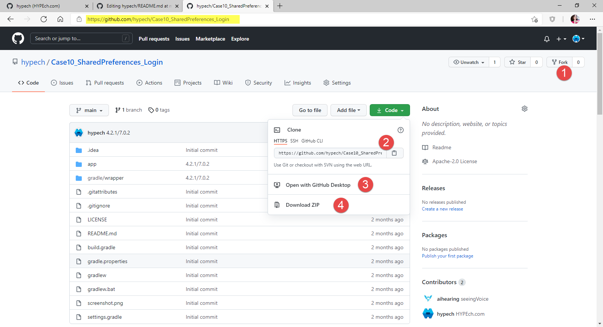

  

# Make your First Android App here! :tada:

New to Android?  
New to Java?  
Don't know where to Start?  
Don't know how to Start? :confused:  

**Here is the One Stop Solution for Every Newcomer!**

### 1. Begin with learning about Android Studio 4.2! How it works and learn about the core skills. :octocat:

You can read the following book, take the following courses/videos.
* [Hands-on App Development in Android Studio 4.2](https://www.amazon.com/gp/product/B096TL8VMP) (22 Complete Android Cases with Step-by-Step Instruction to Grow from Novice to Android Expert)

* [The Youtube Tutorials/Videos are here](https://youtu.be/-fGgwyymOyI) :free:

### 2. **Three ways** to get the cases from Github!

Each case is organized as a seperated project in Github repo. 

### Option 1. Fork the Repository :fork_and_knife:(commonly called as Repo)
If you already have Githup account: Fork the Repo by clicking on the Fork button on the top of this page. This will create a copy of this Repo in your Github account.
Don't forget to `Star`it!

 

### Option 2. Clone the Repo Locally in Android Studio

* Find the Repo link either through book or website, click on the `Clone or Download` button and then click the Copy to Clipboard Icon.:clipboard:
 
* Start Android Studio, and chose "Get from Version Control"
 

The detailed instruction is in Case 4, Calculator.

### Option 4. Download as zip and import to Android Studio
Download to the local drive. Unzip to get the project. 

### bonus: Make necessary changes :white_check_mark:
* Go to [Contributors](https://github.com/Novice-Paradigm/Hello-World/tree/master/Contributors) directory
* Create a file:page_facing_up:.	
* Write about Yourself (in any Language)
  - Name
  - School/College you are studying at or Company you are working at
  - Your github username or link to your github profile
  - Anything else you want to write  
  *Check [Sample](https://github.com/Novice-Paradigm/Hello-World/blob/master/Contributors/Sample.md)*
* Save the File.

### 2.5 Run in your Android Studio

Enjoy :blush:

Support
-------

1. GitHub: https://github.com/hypech/
2. StackOverflow: https://stackoverflow.com/story/hypech
3. Twitter: https://twitter.com/hypechor
4. Youtube: https://youtu.be/-fGgwyymOyI
5. Tiktok: https://www.tiktok.com/@androidcase
6. http://hypech.github.io
7. http://hypech.com
8. hypech.com@gmail.com
